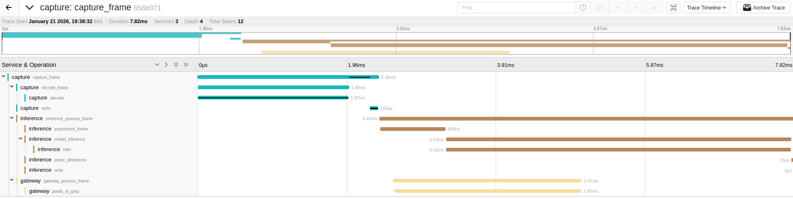

# RF-DETR Object Detection on edge devices with zero-serialization memory-mapped IPC
[](LICENSE)
[](https://github.com/jordandelbar/detr-mmap/actions/workflows/ci.yaml)
[](https://codecov.io/gh/jordandelbar/detr-mmap)

An RF-DETR implementation with Rust, CXX | ORT, FlatBuffers and k3d

## Overview

This project implements a complete edge AI pipeline with RF-DETR object detection, designed for minimal latency and maximum throughput through zero-serialization shared memory communication.
A sentry mode state machine reduces computation by switching to standby when no humans are detected.


## Tech Stack

  - Capture: Camera frame acquisition using [v4l]
  - Inference: [RF-DETR] model inference:
    - CPU: [ORT] with CPU execution provider
    - GPU: [ORT] with CUDA execution provider
    - TensorRT via C++ bindings ([CXX])
  - Controller: State machine managing sentry mode (Standby/Alarmed) based on human detection, publishes events to [MQTT]
  - Gateway: WebSocket [Axum] server streaming frames + detections to clients
  - IPC: Memory-mapped files with [FlatBuffers] for zero-serialization, synchronized with POSIX mqueue semaphores.
  - Broker: [mosquitto] MQTT broker for centralized event collection
  - Observability: [OpenTelemetry] + [Jaeger] for tracing and metrics

## Architecture


## Technical decisions

Edge devices have limited CPU and memory. Network protocol overhead (TCP, HTTP/2, serialization) adds latency and CPU usage.

Memory-mapped files (`mmap`) provide true zero-serialization IPC. There is no serialization, the reader accesses data directly in the writer's memory.
The trade-off is that it only works for local IPC, this is not secured for cloud deployment with shared machine but clearly fitting for edge deployments.

I used k3s even though it adds some memory footprint for the ease of use when it comes to edge deployment.

The pipeline is intentionally asynchronous. Frames are displayed immediately while detections correspond to the previous frame,
introducing <1-frame temporal skew (multiple frame skew if using the CPU). This design maximizes throughput and minimizes perceived latency.

## Installation

 - **Rust** 1.92+ (`rustup default 1.92.0`)
 - **Docker** with buildx
 - **k3d** (lightweight Kubernetes)
 - **ONNX Runtime** (installed automatically in containers)
 - **CUDA** (to run GPU inference)

### Quick Start

#### Local Development (no Kubernetes)

Run locally with Docker Compose using CPU inference:

```bash
# Start all services
just local-up

# Open webpage
just open-webpage

# Stop services
just local-down
```

This runs inference on CPU.

#### k3d Deployment

```bash
# Clone repository
git clone https://github.com/jordandelbar/detr-mmap.git
cd detr-mmap

# Create k3d cluster + deploy services
just up

# Check deployment
kubectl get pods -n detr-mmap

# View logs
kubectl logs -n detr-mmap -l component=inference --follow
```
By default, this runs the TensorRT version of inference, so ensure you have configured your Docker
daemon to run with CUDA. See the next section for setup instructions.

## Running with CUDA

Follow [this guide](https://github.com/jordandelbar/yolo-tonic/blob/a146a7820c173545c47c5c1bac7cdf0417773150/docs/setup/nvidia_docker.md) to set up CUDA correctly.

## Benchmarks & Performance

Benchmarks run on NVIDIA RTX 2060 Super and AMD Ryzen 7 9800x3D with 1920x1080 RGB input frames.

> **Note**: These benchmarks were run on high-end desktop hardware. Edge device performance will vary.
> See [CONTRIBUTING.md](CONTRIBUTING.md) if you can provide benchmarks on Raspberry Pi or Jetson hardware.

### Benchmarks

#### Inference Only

| Backend    | Latency   | Throughput |
|------------|-----------|------------|
| ORT (CPU)  | 66.8 ms   | ~15 FPS    |
| ORT (CUDA) | 15.1 ms   | ~66 FPS    |
| TensorRT   |  3.7 ms   | ~270 FPS   |

#### Full Pipeline (preprocess → inference → postprocess)

| Backend    | Latency   | Throughput |
|------------|-----------|------------|
| ORT (CPU)  | 68.7 ms   | ~15 FPS    |
| ORT (CUDA) | 15.8 ms   | ~63 FPS    |
| TensorRT   |  4.2 ms   | ~240 FPS   |

#### Component Breakdown (1920x1080)

| Component      | Latency  |
|----------------|----------|
| Preprocessing  | 412 µs   |
| Postprocessing | 23 µs    |
| Frame write    | 309 µs   |
| Frame read     | 46 ns    |

#### IPC Performance (FlatBuffers + mmap)

| Scenario           | Write    | Read     | Roundtrip |
|--------------------|----------|----------|-----------|
| No detections      | 22 ns    | 29 ns    | 53 ns     |
| Single detection   | 51 ns    | 51 ns    | 101 ns    |
| Few detections (5) | 113 ns   | 120 ns   | 228 ns    |
| Many detections    | 352 ns   | 350 ns   | 703 ns    |
| Crowded scene      | 1.6 µs   | 1.6 µs   | 3.2 µs    |

Run benchmarks yourself:
```bash
just bench
# HTML reports output to benchmark-reports/
```

### Performance

Here is an example of a typical trace span:



## Testing without a camera

```bash
sudo modprobe v4l2loopback video_nr=0
ffmpeg -re -stream_loop -1 -i video.mp4 -c:v mjpeg -f v4l2 /dev/video0
```

## Ideas about what to do with this repo

 - DevOps: Deploy with KubeEdge instead of K3s (KinD + KubeEdge)
 - MLE: Quantize model to INT8 for lower latency
 - SWE: Replace WebSocket streaming with proper H.264 setup

## Contributing

See [CONTRIBUTING.md](CONTRIBUTING.md)

## License

Licensed under the Apache License, Version 2.0. See [LICENSE](LICENSE) for details.

Note: This project is intended for educational and research purposes.

<!--references-->
[RF-DETR]: https://github.com/roboflow/rf-detr
[v4l]: https://crates.io/crates/v4l
[ONNX]: https://onnx.ai/
[CXX]: https://cxx.rs/
[MQTT]: https://mqtt.org/
[Axum]: https://docs.rs/axum/latest/axum/
[mosquitto]: https://mosquitto.org/
[FlatBuffers]: https://flatbuffers.dev/
[ORT]: https://ort.pyke.io/
[OpenTelemetry]: https://opentelemetry.io/
[Jaeger]: https://www.jaegertracing.io/
