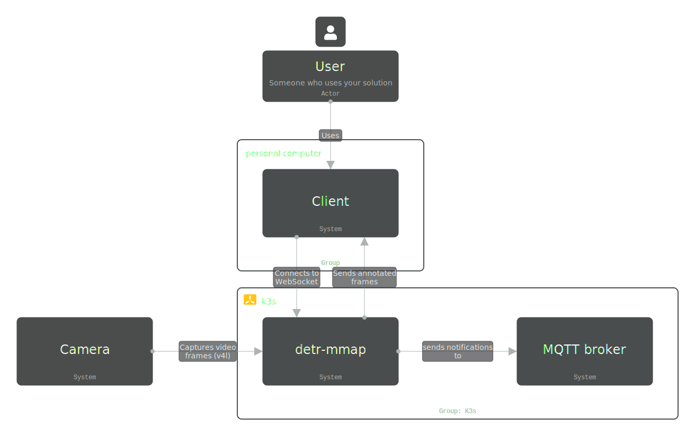
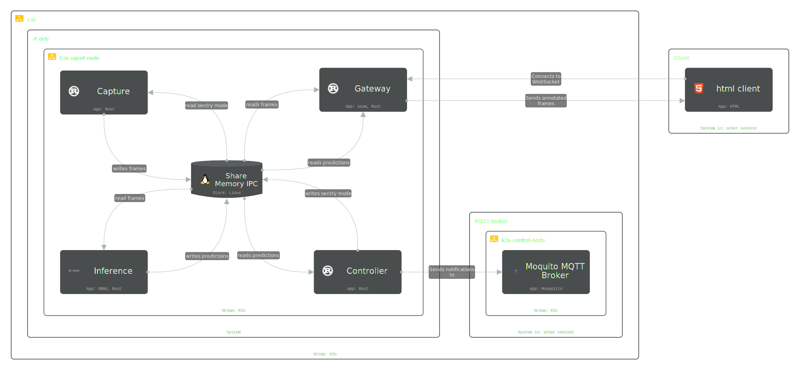

# RF-DETR Object Detection on edge devices with zero-copy memory-mapped IPC
[](LICENSE)
[](https://github.com/jordandelbar/detr-mmap/actions/workflows/ci.yaml)
[](https://codecov.io/gh/jordandelbar/detr-mmap)

A RF-DETR implementation with Rust, CXX | ORT, FlatBuffers and k3d

## Overview

This project implements a complete edge AI pipeline with RF-DETR object detection, designed for minimal latency and maximum throughput through zero-copy shared memory communication.
A sentry mode state machine reduces computation by switching to standby when no humans are detected.

https://github.com/user-attachments/assets/ca26cb26-3bff-4114-a3d7-865d5e437aa8

## Tech Stack

  - capture: Camera frame acquisition using [v4l]
  - inference: [RF-DETR] model inference:
    - Using CPU via [ORT] with CPU execution provider
    - Using Cuda via [ORT] with CUDA execution provider
    - Using TensorRT via C++ bindings using [CXX]
  - controller: State machine managing sentry mode (Standby/Alarmed) based on human detection, publishes events to [MQTT]
  - gateway: WebSocket [Axum] server streaming frames + detections to connected clients
  - [mosquitto]: MQTT broker for centralized event collection (deployed on central node)

Use of mmap with [FlatBuffers] for zero serialization + mqueue semaphore

## Architecture





## Technical decisions

Edge devices have limited CPU and memory. Network protocol overhead (TCP, HTTP/2, serialization) adds latency and CPU usage.

Memory-mapped files (`mmap`) provide true zero-copy IPC. There is no serialization: reader accesses data directly in writer's memory
The trade-off is that it only works for local IPC, this is not secured for cloud deployment with shared machine but clearly fitting for edge deployments.

I used k3s even if it adds some memory footprint for the ease of use when it comes to edge deployment.

## Installation

 - **Rust** 1.92+ (`rustup default 1.92.0`)
 - **Docker** with buildx
 - **k3d** (lightweight Kubernetes)
 - **ONNX Runtime** (installed automatically in containers)
 - **CUDA** (to run GPU inference)

### Quick Start

```bash
# Clone repository
git clone https://github.com/jordandelbar/detr-mmap.git
cd detr-mmap

# Create k3d cluster + deploy services
just up

# Check deployment
kubectl get pods -n detr-mmap

# View logs
kubectl logs -n detr-mmap -l component=inference --follow
```

## Running with CUDA

Follow [this guide](https://github.com/jordandelbar/yolo-tonic/blob/a146a7820c173545c47c5c1bac7cdf0417773150/docs/setup/nvidia_docker.md) to set up CUDA correctly.

## Performance & Benchmarks

Benchmarks run on NVIDIA RTX 2060 Super and AMD Ryzen 7 9800x3D with 1920x1080 RGB input frames.

### Inference Only

| Backend    | Latency   | Throughput |
|------------|-----------|------------|
| ORT (CPU)  | 67.7 ms   | ~15 FPS    |
| ORT (CUDA) | 15.4 ms   | ~65 FPS    |
| TensorRT   |  3.8 ms   | ~263 FPS   |

### Full Pipeline (preprocess → inference → postprocess)

| Backend    | Latency   | Throughput |
|------------|-----------|------------|
| ORT (CPU)  | 72.6 ms   | ~14 FPS    |
| ORT (CUDA) | 17.3 ms   | ~58 FPS    |
| TensorRT   |  5.9 ms   | ~170 FPS   |

### Component Breakdown (1920x1080)

| Component      | Latency  |
|----------------|----------|
| Preprocessing  | 5.2 ms   |
| Postprocessing | 23 µs    |
| Frame write    | 309 µs   |
| Frame read     | 58 ns    |

### IPC Performance (FlatBuffers + mmap)

| Scenario           | Write    | Read     | Roundtrip |
|--------------------|----------|----------|-----------|
| No detections      | 28 ns    | 52 ns    | 79 ns     |
| Single detection   | 55 ns    | 116 ns   | 171 ns    |
| Few detections (5) | 198 ns   | 363 ns   | 563 ns    |
| Many detections    | 744 ns   | 1.3 µs   | 2.1 µs    |
| Crowded scene      | 3.8 µs   | 6.2 µs   | 10 µs     |

Run benchmarks yourself:
```bash
just bench
# HTML reports output to benchmark-reports/
```
## Testing without a camera

```bash
sudo modprobe v4l2loopback video_nr=0
ffmpeg -re -stream_loop -1 -i video.mp4 -c:v mjpeg -f v4l2 /dev/video0
```

## Ideas about what to do with this repo

- If you are a DevOps: try to deploy it with KubeEdge in place of K3s (you can use KinD + KubeEdge)
- If you are a MLE: try to quantize a INT8 model and run it
- If you are a SWE: try to replace the ws with a proper h264 setup

## Contributing

See [CONTRIBUTING.md](CONTRIBUTING.md)

## License

Licensed under the Apache License, Version 2.0. See [LICENSE](LICENSE) for details.

Note: This project is intended for educational and research purposes.

<!--references-->
[RF-DETR]: https://github.com/roboflow/rf-detr
[v4l]: https://crates.io/crates/v4l
[ONNX]: https://onnx.ai/
[CXX]: https://cxx.rs/
[MQTT]: https://mqtt.org/
[Axum]: https://docs.rs/axum/latest/axum/
[mosquitto]: https://mosquitto.org/
[FlatBuffers]: https://flatbuffers.dev/
[ORT]: https://ort.pyke.io/
